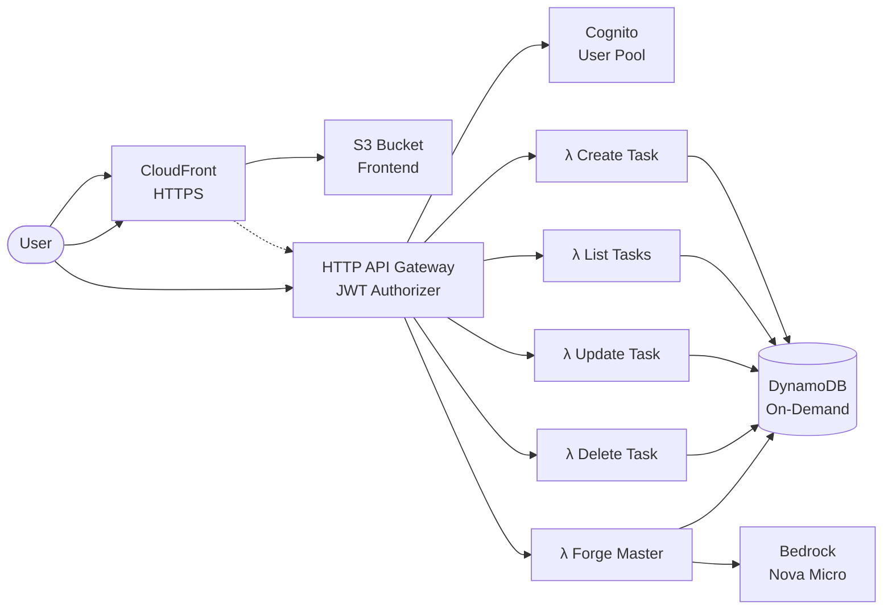

# ⚒️ FocusForge

A focus-session productivity app themed around blacksmithing. Tasks are raw iron;
focus sessions forge them into collectable items of increasing rarity. Quench
early and the piece is ruined.

Originally built for the [AWS Builder Center Full Stack Challenge](https://builder.aws.com/content/3HsR4HTQTmLr0rfB6eP9umSnrEQ/the-full-stack-challenge).
Random word: **Anvil**.

## Architecture

Single SAM stack. One `sam delete` removes everything.



**AWS services:** CloudFront, S3, API Gateway (HTTP), Lambda, DynamoDB,
Cognito, Bedrock (Amazon Nova Micro).

### Security design

Aligned with the [AWS Well-Architected Serverless Lens](https://docs.aws.amazon.com/wellarchitected/latest/serverless-applications-lens/general-design-principles.html)
and [Cognito security best practices](https://docs.aws.amazon.com/cognito/latest/developerguide/user-pool-security-best-practices.html):

**Authentication & access control:**
- **No public signup**: `AllowAdminCreateUserOnly: true`. Users created via CLI only.
- **JWT authorizer**: API Gateway validates Cognito tokens on every request.
- **Short token lifetimes**: access/ID tokens expire in 1 hour, refresh in 7 days.
- **PreventUserExistenceErrors**: Cognito won't reveal whether an account exists.
- **Strong password policy**: 12+ chars, mixed case, numbers, symbols required.

**Infrastructure:**
- **Per-function IAM roles**: each Lambda gets only the DynamoDB actions it needs
  ([least privilege](https://docs.aws.amazon.com/lambda/latest/dg/least-privilege-iam.html)).
- **OAC-secured S3**: the frontend bucket blocks all public access; only CloudFront
  can read it via [Origin Access Control](https://docs.aws.amazon.com/AmazonCloudFront/latest/DeveloperGuide/private-content-restricting-access-to-s3.html).
- **Bedrock scoped IAM**: invoke permission limited to a single model ARN.
- **Encryption at rest**: DynamoDB SSE enabled (default, free).
- **PITR enabled**: Point-in-time recovery protects against accidental deletes.
- **CORS restricted**: only localhost and the CloudFront domain are allowed origins.
- **API throttling**: API Gateway burst/rate limit set to 50 req/s.

**Application:**
- **Input validation**: Zod schemas on all Lambda handlers reject malformed payloads.
- **UUID format validation**: Path parameters checked before reaching DynamoDB.
- **DynamoDB partition isolation**: queries scoped to `userId` partition key; condition expressions verify ownership on update/delete.
- **Bedrock Guardrails**: managed prompt injection detection, content filtering (hate, insults, misconduct) at the platform level.
- **LLM output validation**: Zod schema on Bedrock responses; only accepts expected JSON shapes with enumerated values.
- **Input sanitization**: task titles stripped of control chars, unicode tricks, and angle brackets before reaching the AI prompt.
- **Security headers**: CloudFront Response Headers Policy enforces HSTS, CSP, X-Frame-Options, X-Content-Type-Options.
- **No console output**: zero `console.log`/`error`/`warn` in production frontend code.
- **No source maps**: production build omits `.js.map` files.
- **No secrets in source**: `just test-secrets` runs [TruffleHog](https://github.com/trufflesecurity/trufflehog), [Gitleaks](https://github.com/gitleaks/gitleaks), and [detect-secrets](https://github.com/Yelp/detect-secrets).

**Audited against:**
- [OWASP Top 10 Web (2021)](https://owasp.org/Top10/2021/)
- [OWASP API Security Top 10 (2023)](https://owasp.org/API-Security/editions/2023/en/0x00-toc/)
- [OWASP Top 10 for LLM Applications (2025)](https://genai.owasp.org/llm-top-10/)
- [OWASP Serverless Top 10](https://github.com/OWASP/Serverless-Top-10-Project)

## Prerequisites

- [AWS CLI v2](https://docs.aws.amazon.com/cli/latest/userguide/getting-started-install.html)
  configured with credentials ([IAM Identity Center recommended](https://docs.aws.amazon.com/sdkref/latest/guide/access-sso.html))
- [AWS SAM CLI](https://docs.aws.amazon.com/serverless-application-model/latest/developerguide/install-sam-cli.html) ≥ 1.100
- [Node.js 20+](https://nodejs.org/)
- [esbuild](https://esbuild.github.io/) on PATH (SAM uses it to bundle Lambda TypeScript)
- [Docker](https://docs.docker.com/get-docker/) (SAM builds Lambda packages in containers)
- [just](https://just.systems/) (command runner, optional; you can run commands manually)
- **Bedrock model access:** Enable `amazon.nova-micro-v1:0` in your region via the
  [Bedrock console](https://console.aws.amazon.com/bedrock/home#/modelaccess).

**NixOS users:** `direnv allow` in the repo root gives you all of the above via `shell.nix`.

## Deploy (from zero to running)

Every step below is automated. All values come dynamically from your AWS
session and the deployed CloudFormation stack. Nothing is hardcoded, nothing
needs to be copied between steps.

```bash
# 1. Install all dependencies
just setup

# 2. Deploy everything (creates bucket + stack + writes samconfig.toml)
just bootstrap

# 3. Create yourself as a user
just create-user you@example.com
just set-password you@example.com 'Your!Long#Passphrase42'

# 4. Deploy the frontend (auto-reads stack outputs, builds, syncs, invalidates cache)
just deploy-frontend

# 5. Visit your app
just infra-status
# Open the FrontendUrl in your browser
```

That's it. No S3 buckets to create manually, no `.env` files to edit, no IDs
to copy between steps. Everything resolves dynamically from the stack.

**Subsequent deploys:** `just infra-up && just deploy-frontend`

**Full teardown (removes everything including the deploy bucket):** `just panic`

## Local Development

```bash
just dev-frontend     # Vite dev server on :5173
just dev-api          # SAM local API (requires Docker)
just db-up            # DynamoDB Local in Docker
```

The Vite dev server proxies `/api` → `localhost:3000` (SAM local).

## Testing

```bash
# Unit & quality tests (run locally, no AWS needed)
just test             # All: contrast + a11y + frontend unit + audit
just test-contrast    # WCAG AA colour contrast check (static token math)
just test-a11y        # axe-core accessibility audit (Deque) against built HTML
just test-frontend    # Vitest unit tests (progression logic)
just test-audit       # npm audit for known dependency vulnerabilities
just test-secrets     # TruffleHog + Gitleaks + detect-secrets scanning

# Integration test (requires deployed stack + AWS session)
just infra-test       # Asserts unauthenticated requests get 401

# Manual smoke test (full loop)
just get-token you@example.com  # Get a JWT
# Then use it to test the API directly:
#   curl -H "Authorization: Bearer <token>" <API_URL>/tasks
```

## Commands

```bash
just                    # List all recipes
just setup              # Install all deps
just bootstrap          # First-time deploy (creates bucket + stack + config)
just infra-up           # Build + deploy (subsequent deploys)
just infra-status       # Show every stack resource
just infra-down         # Destroy the stack
just infra-verify       # Confirm no orphan resources
just deploy-frontend    # Build frontend + sync to S3 + invalidate cache
just panic              # Emergency teardown (removes everything including logs)

just create-user EMAIL          # Create a Cognito user
just set-password EMAIL PASS    # Set a permanent password
just get-token EMAIL            # Get a JWT for API testing
just reset-forge-limit EMAIL    # Clear today's AI rate limit
just reset-user-data EMAIL      # Wipe all data for a user (fresh start)

just test               # All tests (contrast + a11y + unit + audit)
just test-contrast      # WCAG AA colour contrast check
just test-a11y          # axe-core accessibility audit
just test-frontend      # Vitest unit tests (progression logic)
just test-audit         # npm audit for known vulnerabilities
just test-secrets       # Scan for leaked secrets (trufflehog + gitleaks + detect-secrets)
just test-rate-limit    # Integration test: verify Forge Master 429 on limit
```

## Teardown

```bash
just infra-down       # Deletes the entire CloudFormation stack
just infra-verify     # Confirms nothing remains
```

Or: `just panic` (deletes without prompts, then verifies).

**S3 bucket note:** CloudFormation cannot delete a non-empty S3 bucket. If
`sam delete` fails on the frontend bucket, empty it first:
```bash
aws s3 rm s3://<FrontendBucketName> --recursive
sam delete --no-prompts
```

## Project Structure

```
├── frontend/           React 18 + Vite + TypeScript (SPA)
│   ├── src/
│   │   ├── components/ UI components (Login, TaskList, Smithy, etc.)
│   │   ├── hooks/      Timer, persistence, onboarding
│   │   ├── lib/        Progression system, auth, API client
│   │   └── theme/      CSS custom properties + dark/light toggle
│   └── .env.example    Frontend env template
├── functions/          Lambda handlers (TypeScript, esbuild-bundled)
│   ├── tasks/          CRUD: create, list, update, delete
│   └── forge-master/   AI task sizing via Bedrock Nova Micro
├── scripts/            Shell helpers (create-user, get-token, infra checks)
├── template.yaml       SAM/CloudFormation: the entire infrastructure
├── justfile            Command runner recipes
├── shell.nix           NixOS reproducible dev environment
└── docker-compose.yml  DynamoDB Local for offline development
```

## Cost

Designed to stay within or near the AWS Free Tier for personal use:

| Service | Free Tier | Notes |
|---------|-----------|-------|
| DynamoDB | 25 GB storage | On-demand, scales to zero |
| Lambda | 1M requests + 400K GB-s/month | arm64 for lower cost per ms |
| API Gateway | 1M HTTP API calls/month (12 months) | Pennies after, at personal scale |
| Cognito | 10,000 MAU (Lite/Essentials, never expires) | Admin-only, single user |
| CloudFront | 1 TB transfer/month | Always free, no expiry |
| S3 | 5 GB (12 months) | Frontend assets only |
| Bedrock Nova Micro | $0.035/1M input, $0.14/1M output | No free tier; ~$0.00 at personal scale |

**Expected monthly cost for personal use: $0.00–$0.10.**

## License

MIT
